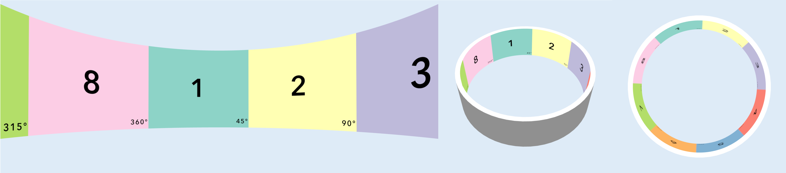
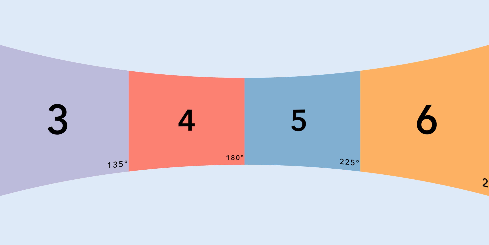
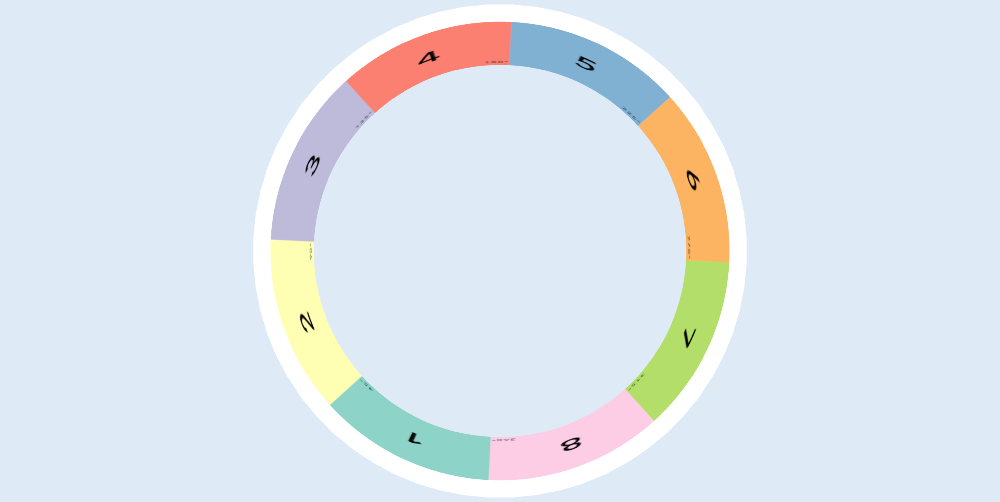
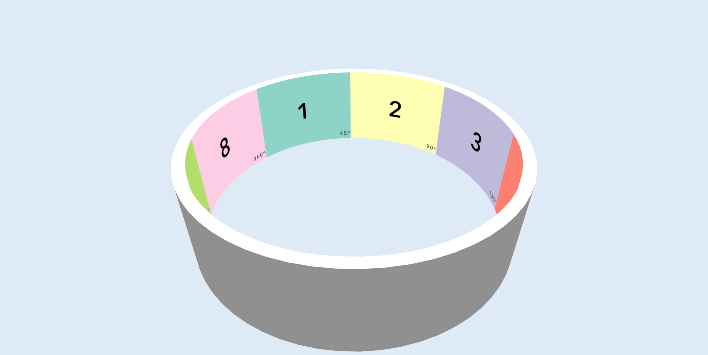
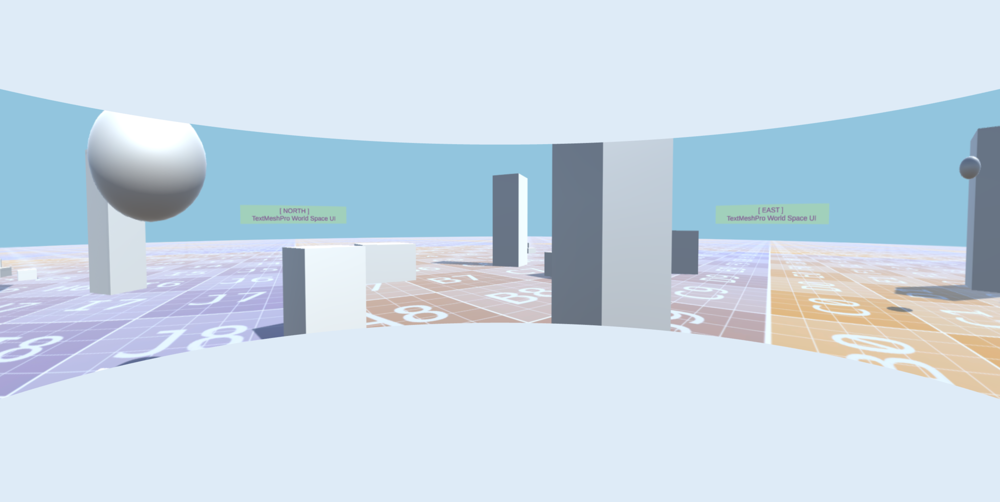
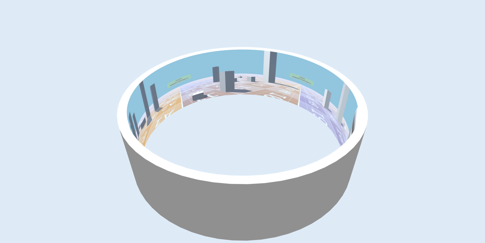
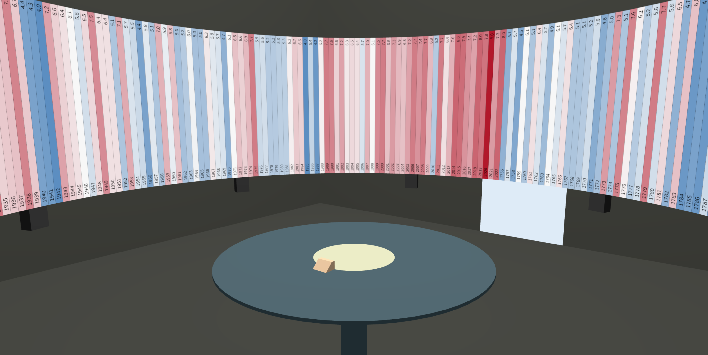

# three.js - Cylindrical Display Preview

Lightweight web-based implementation to visually preview image content inside an immersive 3D cylindrical display.

## Table of Contents
* [Background](#Background)
* [Features](#Features)
* [Dependencies](#Dependencies)
* [Documentation](#Documentation)
* [Screenshots](#Screenshots)
* [License](#License)

## Background
Some of my research interests evolve around the visualization of data in immersive information spaces. One such space is the [Norrköping Decision Arena](https://liu.se/en/research/norrkoping-decision-arena) at Linköping University, Campus Norrköping, featuring a large 360-degree cylindrical display that can be utilized as a visualization platform. This project is intended to provide capabilities to preview data visualizations for display in such a (or similar) cylindrical display facilities without the need to be physically on-site, aiming to streamline the process of testing created data visualizations.

## Features
* web-based implementation that can run locally/offline or be deployed online
* responsive canvas that automatically adjusts to the window size of the web browser
* easy to configure cylindrical display model (radius, height, geometry)
* easy to add own images (textures) for preview in the cylindrical display
* camera (rotate, zoom) interaction
* keyboard interaction to iterate between multiple images for preview

## Dependencies
This project has been built using the following specifications:

* [HTML](https://developer.mozilla.org/en-US/docs/Web/HTML)
* [CSS](https://developer.mozilla.org/en-US/docs/Web/CSS)
* [JavaScript](https://developer.mozilla.org/en-US/docs/Web/JavaScript/Reference)
* [JSON](https://developer.mozilla.org/en-US/docs/Web/JavaScript/Reference/Global_Objects/JSON)
* [three.js](https://github.com/mrdoob/three.js) r170

## Documentation
### Project File Structure
File|Description
:---|:---
`index.html`|HTML implementation
`styles.css`|CSS implementation, linked in `index.html`
`scripts.js`|Main implementation of the project based on JavaScript to create the overall 3D scene with the cylindrical display model under utilization of the three.js library, linked in `index.html`
`config.js`|Configuration of the 3D scene and the cylindrical display model in JSON, imported in `scripts.js`
`data.js`|References to the image data (texture file paths) for cylindrical display preview in JSON, imported in `scripts.js`
`lib`|Directory with library files, e.g., three.js
`public`|Directory where the image data (texture files) should be placed
`docs`|Files related to the documentation of this project

### How to use
#### Run the implementation locally/offline
To run the web-based application locally on your computer, the following steps are recommended:

1. Install [Visual Studio Code](https://code.visualstudio.com).
2. Install the Visual Studio Code extension [Live Server](https://marketplace.visualstudio.com/items?itemName=ritwickdey.LiveServer) *by* Ritwick Dey.
3. Clone/download this repository.
4. Open Visual Studio Code, select `Open Folder...`, and navigate to the location of the cloned/downloaded repository.
5. Select `Go Live` in the Visual Studio Code status bar (by default, located at the bottom right of the interface). Your default web browser should open automatically and display the web application, by default running at the IP address `127.0.0.1:5500`.

#### Interactive features
The application supports the following interactions:

* `mouse - left hold & move`: rotate
* `mouse - scroll forward/backward`: zoom in/out
* `keyboard - arrow right/left`: iterate to the next/prev image based on all the entries in the `data.js` file

#### Add your own images
To add your own images for preview in the cylindrical display, two steps are required:

1. Ideally, place your prepared image in `.png` file format inside the `public` directory.
2. Open and edit the `data.js` file by adding a JSON object with the key `textureUrl` as well as the value referencing the file path and name of your image file (see step 1).

*Note #1*: Please inspect the `data.js` file and follow the implemented structure. By default, the project includes two representative images for display in the application. First, a test/reference image, dividing the cylindrical 360 space into eight equally sized sections. And second, a 3D scene rendered with an equirectangular projection (cylindrical equidistant projection). 

*Note #2*: For appropriate preview/projection, the image files should be in a resolution and/or aspect ratio that correspond to the cylindrical display configuration (see `CylindricalDisplayConfig` in `config.js`). To determine the aspect ratio based on `radius` (r) and `height` (h), first calculate the cylindrical display circumference (c = 2 * PI * r), and then determine the aspect ratio (ar:1 = c / h).

#### Change the configuration of the 3D scene and the cylindrical display
To adjust the default settings of the 3D scene, including the camera's position and focus point, as well as the cylindrical display model, simply open, inspect, and edit the `config.js` file. Note that the intended unit convention corresponds to 1 unit == 1 meter.

## Screenshots

Cylindrical Display Preview, Example 1: Front\

Cylindrical Display Preview, Example 1: Top Down\

Cylindrical Display Preview, Example 1: Angled\

Cylindrical Display Preview, Example 2: Front\

Cylindrical Display Preview, Example 2: Angled\

Cylindrical Display Preview, Extended Example: A [warming stripes](https://en.wikipedia.org/wiki/Warming_stripes) data visualization with additional 3D geometry to visually represent potential physical surroundings of the cylindrical display (*not included as part of this repository*)\

## License
MIT License, see [LICENSE.md](LICENSE.md)
